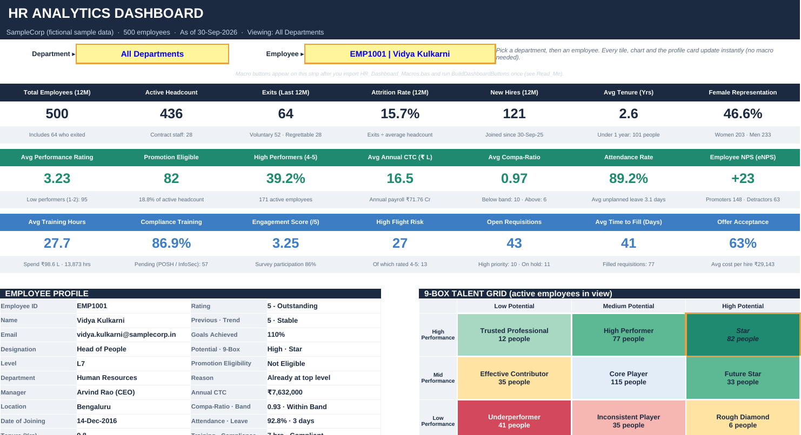
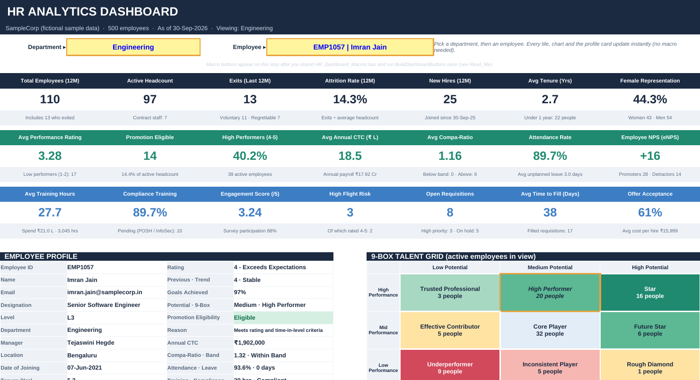
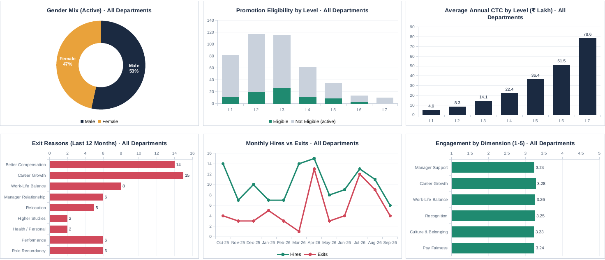
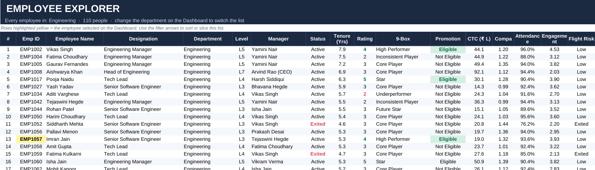

# HR Analytics Dashboard in Excel

An interactive HR analytics workbook built in Microsoft Excel for a fictional company of 500 employees. It combines eight HR data sheets into one dashboard. You can view the whole organisation, then filter by department and open any employee's profile.

The dashboard runs on formulas, so it works in a standard `.xlsx` file. Optional VBA macros add one-click actions such as a promotion list, a flight-risk watch list, a department report export and a PDF export.

> **Note:** All employees, names and figures in this workbook are fictional sample data created for demonstration. No real company or employee data is used.



---

## Business questions this dashboard answers

As an HR Business Partner, these are the questions I am asked most often. The dashboard answers each one for the whole organisation or for any single department.

| Question | Where to look |
|---|---|
| How many people do we have, and how is the team changing? | Headcount, new hires and exits tiles, plus the monthly hires vs exits trend |
| What is our attrition rate, and why are people leaving? | Attrition rate tile and the exit reasons chart, including regrettable exits |
| Who is ready for promotion? | Promotion Eligible tile, promotion by level chart and the Promotion List macro |
| Who are our stars, and who needs support? | 9-box talent grid and the rating distribution chart |
| Are we paying people fairly within their band? | Average compa-ratio tile and the average pay by level chart |
| Which valued employees might leave next? | High Flight Risk tile, flight-risk chart and the Flight-Risk List macro |
| How engaged are our people? | Engagement score, eNPS and the six engagement dimensions |
| How well is hiring going? | Open requisitions, time to fill, offer acceptance and hires by source |

---

## Screenshots

**Department view: Engineering selected, with one employee's profile and their place on the 9-box grid**



**Workforce charts: all 12 charts follow the department selection**



**Employee Explorer: every employee in the selected department with their key metrics**



---

## What is inside the workbook

| Sheet | What it holds |
|---|---|
| **Read_Me** | How to use the workbook and a colour key |
| **Dashboard** | Department and employee selectors, 21 KPI tiles, an employee profile card, a 9-box talent grid, 12 charts and a department scorecard |
| **Employee_Explorer** | A filterable list of every employee in the selected department |
| **Employee_Master** | 500 employees: ID, name, email, manager, designation, level, department, gender, location, employment type, joining date. Status, tenure and direct reports are calculated |
| **Performance** | Rating (1 to 5), rating trend, goals achieved, potential, 9-box category, time in current level, **promotion eligibility and the reason** |
| **Compensation** | Annual pay against level pay bands, compa-ratio, band position, increment, revised pay, bonus and stock option eligibility |
| **Attendance_Leave** | Working days, planned, sick and unplanned leave, attendance rate, work-from-home days, late marks, overtime and an absence flag |
| **Training** | Programs, courses, hours, cost, assessment score, POSH and information security training, certifications |
| **Engagement** | Six survey dimensions, overall engagement, eNPS score and category, and a **flight-risk score** |
| **Exits_Attrition** | 64 exits in the last 12 months: exit type, reason, regrettable loss, notice period, rehire eligibility, exit interview status |
| **Recruitment** | 140 job requisitions: hiring funnel, status, source, time to fill, offer acceptance and cost per hire |
| **Settings** | The rules behind the model (promotion criteria, pay bands, flight-risk thresholds, reporting date). Change a value and the whole workbook updates |
| **Calc_Engine** (hidden) | Helper calculations for the filtered employee list and the chart data |

---

## Key metrics on the dashboard

Every tile and chart recalculates when you change the department.

- **Workforce:** total employees, active headcount, new hires, average tenure, female representation
- **Attrition:** exits in the last 12 months, attrition rate, voluntary and regrettable exits
- **Performance:** average rating, promotion-eligible employees, share of high performers
- **Pay:** average annual pay, average compa-ratio, employees below and above their pay band
- **People experience:** attendance rate, engagement score, eNPS, employees at high flight risk
- **Learning and compliance:** average training hours, training spend, compliance training completion
- **Hiring:** open requisitions, average time to fill, offer acceptance rate, cost per hire

---

## Business rules used

All thresholds are stored on the **Settings** sheet and can be changed.

| Measure | How it is calculated |
|---|---|
| **Promotion eligibility** | Active employee with a rating of 4 or higher, at least 1.5 years in the current level, and not already at the top level (L7) |
| **Attrition rate** | Exits in the last 12 months divided by average headcount (opening headcount plus closing headcount, divided by 2) |
| **Compa-ratio** | Annual pay divided by the midpoint of the pay band for that level |
| **9-box category** | Performance band (High = rating 4 to 5, Mid = 3, Low = 1 to 2) combined with potential (Low, Medium, High) |
| **eNPS** | Percentage of promoters (score 9 to 10) minus percentage of detractors (score 0 to 6), among active employees who took the survey |
| **Flight risk** | One point each for: engagement below 3.0, eNPS score of 6 or lower, compa-ratio below 0.90, rating of 4 or 5. Three or more points = High, two = Medium, otherwise Low |

---

## Excel skills demonstrated

- **Lookups across sheets** with `INDEX` and `MATCH`, linking every data sheet to the employee master
- **Conditional aggregation** with `COUNTIFS`, `AVERAGEIFS` and `SUMIFS`, using a wildcard so one formula serves both "All Departments" and a single department
- **More than 60 named ranges** that keep formulas readable, for example `COUNTIFS(P_Dept, SelCrit, P_Elig, "Eligible")`
- **Dependent dropdown list:** the employee list only shows people in the selected department, built with `OFFSET` over a filtered helper list
- **Two-way matrix lookup** for the 9-box talent grid
- **Dynamic chart titles** linked to the selected department
- **Conditional formatting:** colour scales, data bars and formula-based rules that highlight the selected department and the selected employee's 9-box cell
- **Model built on assumptions:** every rule and threshold sits in one Settings sheet, with input cells colour-coded
- **VBA macros** for automation (see below)

---

## VBA macros

The file `HR_Dashboard_Macros.bas` contains the macros. After you import them, one setup macro adds a row of buttons to the dashboard.

| Button | What it does |
|---|---|
| Reset | Returns the dashboard to All Departments |
| Previous / Next | Moves through employees in the selected department one at a time |
| Find Employee | Searches by part of a name or an employee ID and opens that profile |
| Promotion List | Creates a sheet of promotion-eligible employees for the selected department, sorted by rating |
| Flight-Risk List | Creates a watch list of high flight-risk employees, with top performers highlighted |
| Export Dept Report | Saves a new Excel file with the KPI summary and employee list for the selected department |
| Save as PDF | Exports the dashboard to a PDF |
| Refresh | Recalculates the workbook |

---

## How to use

### Without macros
1. Download `HR_Analytics_Dashboard.xlsx` and open it in Microsoft Excel (desktop or web).
2. Go to the **Dashboard** sheet.
3. Choose a department from the **Department** box, or keep **All Departments** to see the whole organisation.
4. Choose a person from the **Employee** box to see their profile card and their place on the 9-box grid.
5. Open **Employee_Explorer** to see everyone in the selected department.

### With macros (Excel desktop)
1. **Show the Developer tab:** click **File** > **Options** > **Customize Ribbon**, tick **Developer**, then click **OK**.
2. **Import the macros:** click **Developer** > **Visual Basic**. In the editor, click **File** > **Import File...**, select `HR_Dashboard_Macros.bas`, then close the editor.
3. **Save as macro-enabled:** click **File** > **Save As** > **Browse**, choose **Excel Macro-Enabled Workbook (*.xlsm)** and click **Save**.
4. **Add the buttons:** click **Developer** > **Macros**, select **BuildDashboardButtons** and click **Run**. Then save the file.

If Excel blocks the macros when you reopen the file, click **Enable Content** on the yellow bar. If you see a red bar instead, close Excel, right-click the file in File Explorer, choose **Properties**, tick **Unblock**, click **OK** and open the file again.

> Macros run in Excel for Windows and Mac. They do not run in Excel for the web, but the dashboard, dropdowns and charts still work there.

---

## Repository structure

```
hr-analytics-excel-dashboard/
├── README.md
├── HR_Analytics_Dashboard.xlsx     Workbook (formulas only, no macros)
├── HR_Dashboard_Macros.bas         VBA module to import
└── images/
    ├── dashboard-overview.png
    ├── department-view-engineering.png
    ├── workforce-charts.png
    └── employee-explorer.png
```

---

## About me

**Sonali K** is a Senior HR Business Partner with close to 10 years of experience across HR business partnering and talent acquisition, currently completing a PGDM in Human Resources Management at Goa Institute of Management.

- LinkedIn: [linkedin.com/in/karapana-sonali-a2b3b3151](https://www.linkedin.com/in/karapana-sonali-a2b3b3151/)
- Medium: [medium.com/@sonali.karpana](https://medium.com/@sonali.karpana)
- Portfolio: [HRBP portfolio page](https://claude.ai/artifact/ERRckqus1xfhjw6wGKn63g)

Feedback and suggestions are welcome. Please open an issue or connect with me on LinkedIn.
